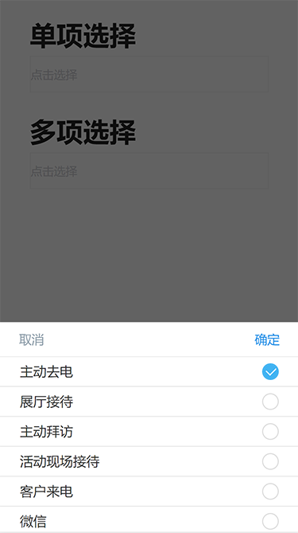
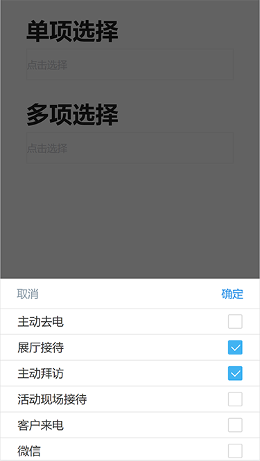

# Down_select
> Mobile下拉单选和多选框插件，依赖于Jquery

> Downcheck(Data,Domvalue,Domtext,Type)

## 参数设置

* Data 
	> --- 数据源
* Domvalue 
	> --- 输入框存储的值
* Domtext  
	> --- 输入框显示容器
* Type  
	> --- 选项框的类型 1为多选  不输入为单选

### 效果展示	

